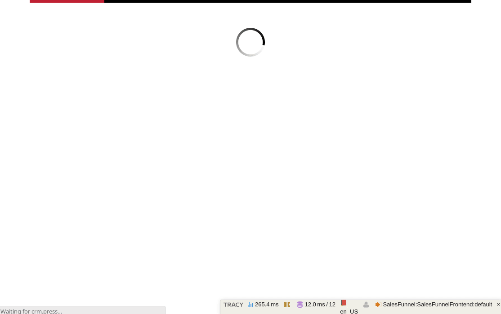

# CRM Privatbankar Module

[](https://hosted.weblate.org/projects/remp-crm/privatbankar-module/)

## Installation

We recommend using Composer for installation and update management. To add CRM Stripe extension to your [REMP CRM](https://github.com/remp2020/crm-skeleton/) application use following command:

```bash
composer require remp/crm-privatbankar-module
```

Enable installed extension in your `app/config/config.neon` file:

```neon
extensions:
	# ...
	- Crm\PrivatbankarModule\DI\PrivatbankarModuleExtension
```

Seed Privatbankar payment gateway and its configuration:

```bash
php bin/command.php application:seed
```

## Configuration & API keys

Enter Stripe API keys to CRM

   - Visit to CRM admin settings (gear icon) - Payments
   - Enter *Privatbankar source*
   - Enter *Privatbankar mode* key
    
You can obtain `source` by contacting Privatbankar gateway operators directly. You'll be required to enter callback URLs for different scenarios (change the domains based on your configuration):

- `url_success`: http://crm.press/privatbankar/return/thankyou
- `url_error`: http://crm.press/privatbankar/return/error
- `url_cancel`: http://crm.press/privatbankar/return/cancel
- `url_timeout`: http://crm.press/privatbankar/return/timeout
- `url_ipn`: http://crm.press/api/v1/privatbankar/ipn (make sure this URL is accessible from the Internet)

## Using module

Add gateway to your sales funnel configuration - available at funnel detail page in CRM admin. If the gateway is configured correctly, there's nothing else required.

Please be aware, that payment is confirmed only after the Instant Payment Notification (IPN) is received.

### Sample funnel

You can test the configuration by using `privatbankar-sample` funnel, which is seeded during installation. If everything works, don't forget to disable the funnel so it's not accessible in production.



### Custom confirmation pending message

The message which user sees while he/she waits for the confirmation approval is extendable/replaceable with widgets. You can:

- In your own module, create new widget and extend the message displayed to user or attach your own behavior.

    ```php
    public function registerWidgets(\Crm\ApplicationModule\Widget\WidgetManagerInterface $widgetManager)
    {
        $widgetManager->registerWidget(
            'privatbankar.return.pending',
            $this->getInstance(CustomConfirmationWidget::class),
            200
        );
    }
    ```
  
- In your own module, remove the default widget in case you don't want to display the original "confirmation pending" message.

    ```php
    public function registerWidgets(\Crm\ApplicationModule\Widget\WidgetManagerInterface $widgetManager)
    {
        $widgetManager->removeWidget(
            'privatbankar.return.pending',
            $this->getInstance(\Crm\PrivatbankarModule\Components\ConfirmationPendingWidget::class)
        );
    }
    ```